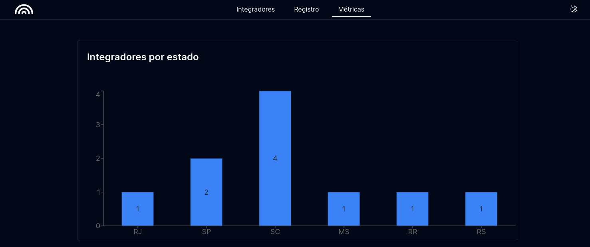
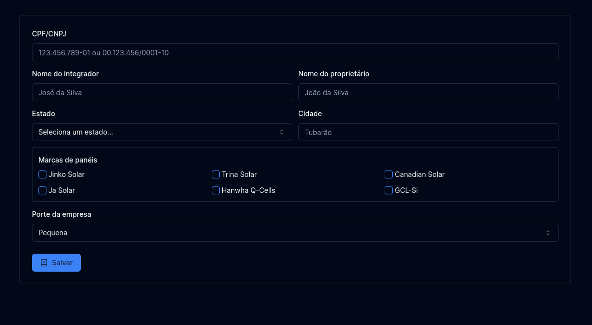
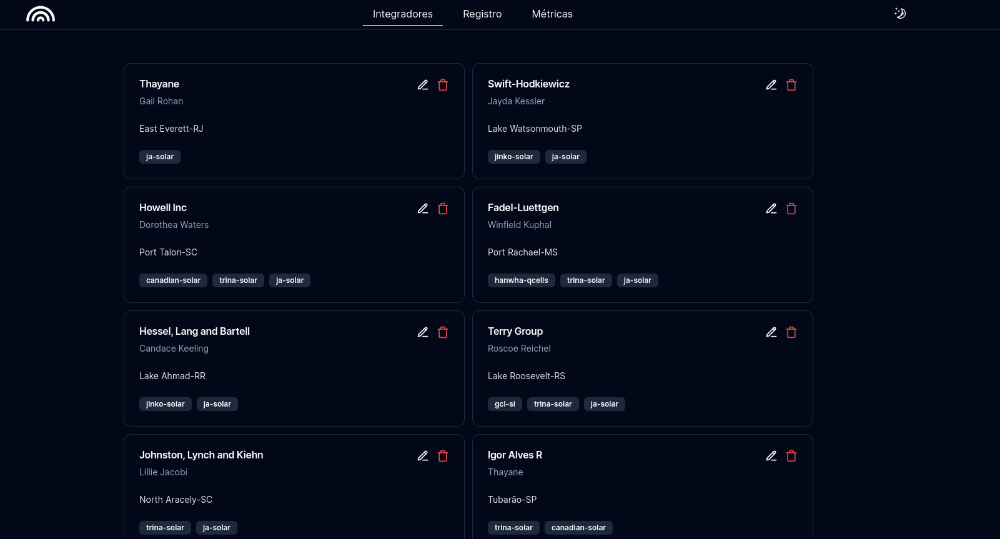
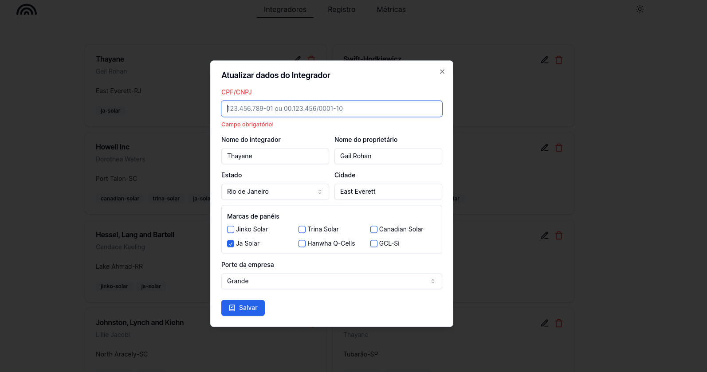

# CADASTRO DE INTEGRADORES (Frontend)


> Esta é uma aplicação desenvolvida para um teste técnico requisitado pela empresa Innova Connect. O teste foi realizado anteriormente 
utilizando outras tecnologias. Atualmente refiz o projeto utilizando das boas praticas de desenvolvimento, dentre elas testes automatizados,
inversão e injeção de dependência, SOLID, e etc. 

<div style="width:100%; display:flex; align-items:center; gap:16px; flex-direction: column;">
  <div style="display: flex; justify-content: center; gap: 10px;">
    
    
  </div> 
  <div style="display: flex; justify-content: center; gap: 10px;">
    
    
  </div>
</div>

## 📄 Detalhes da aplicação

- O projeto consiste em um cadastro de integradores (empresas instaladoras de paineis solares), no qual o usuário pode
inserir, atualizar e remover um integrador. Para a listagem dos integradores foram utilizados cards para uma melhor experiência
do usuário, utilizando um design limpo e consistente. O usuário também pode verificar através de gráficos algumas informações 
importantes sobre os integradores registrados.

- Para consumir as informações foi utilizado o pacote json-server.

## 👨‍💻 Tecnologias utilizadas

- Tailwindcss (Ferramenta para produtividade na estilização)
- Shadcn/UI (Lib de components para melhorar a produtividade)
- NextJs(React)
- Lucide React (Biblioteca para ícones)
- CPF CNPJ Validator (Biblioteca para validação de CPF e CNPJ)
- React Hook Forms (Biblioteca para formulários)
- Zod (Biblioteca para validação das informações)
- Axios (Biblioteca para efetuar as requisições HTTP)
- Testing Library (Biblioteca de testes)

## 💡 Padrões abordados

- Foi escolhido o uso de uma biblioteca que utiliza a composição de componentes,
utilizando esse padrão o código fica mais legível e de fácil manutenção. (Lib: Shadcn-ui)

## 🚀 Melhorias futuras
- [ ] - Criação de um contexto para injetar os serviços, removendo a dependência da api nas páginas.
- [ ] - Criação de mais gráficos aprensentando informações importantes.
- [ ] - Implementar testes e2e para testar o fluxo completo das operações.

## 💻 Como rodar o projeto
Para utilizar e testar o projeto, esteja em um computador com Node Js instalado e siga as
etapas abaixo:

- OBS: * Necessário node 18 instalado na máquina.

1 Clone o projeto com o comando
```
git clone https://github.com/IgorAlvesR/integrators-register-frontend.git
```
2 Acesse o projeto da UI pelo terminal com o comando
```
cd integrators-register-frontend
```
3 Instale as dependências necessárias com o comando
```
npm install
```
4 Crie uma arquivo `.env` no diretório
```
API_BASE_URL=(endereço da api, ex: http://localhost:3001)
```
5 Rode o seguinte comando para subir a aplicação
```
npm run dev
```
6 Acesse o projeto
```
http://localhost:3000
```
7 Para rodar os testes automatizados do projeto, você pode executar todos de uma vez, ou optar por executar de acordo com o
tipo de teste
```
npm run test -> para rodar todos os testes
npm run test:unit -> para testes unitários
npm run test:integration -> para testes de integração
```

## Acesse o projeto em https://integradores.vercel.app/

## 🌐 Links úteis
[NodeJS](https://nodejs.org/en/download)
[Tailwind](https://tailwindcss.com/)
[ShadcnUI](https://ui.shadcn.com/)
[LucideReact](https://lucide.dev/)
[TestingLibrary](https://testing-library.com/)
[Axios](https://axios-http.com/docs/intro)
[CpfCnpjValidator](https://www.npmjs.com/package/cpf-cnpj-validator)
[Zod](https://zod.dev/)
[ReactHookForms](https://react-hook-form.com/)
[NextJs](https://nextjs.org/)


## 🧑‍💻 Igor Alves Rodrigues

[](https://www.linkedin.com/in/igor-alves-rodrigues-7941a116b/)
[](https://gthub.com/igoralvesr)
[](http://wa.me/5548998434969)
[](https://igoralvesr.github.io)